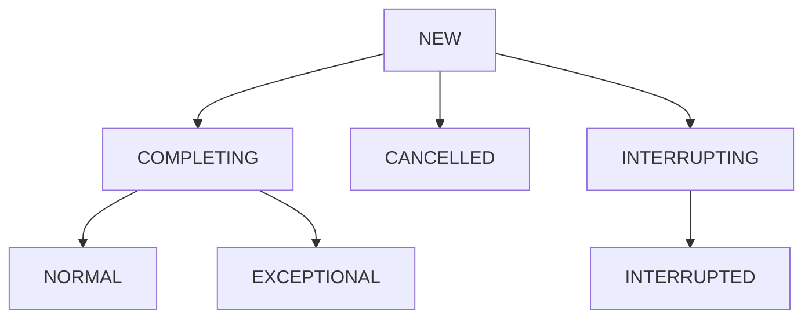

# FutureTask源码分析

FutureTask为future提供了基础实现，而且也是我们用的最多的实现方式。

接下来，将会对FutureTask展开深入的分析。

## 核心属性

```java
    /**
     * 任务的运行状态。
     * 可能的状态转换:
     * NEW -> COMPLETING -> NORMAL
     * NEW -> COMPLETING -> EXCEPTIONAL
     * NEW -> CANCELLED
     * NEW -> INTERRUPTING -> INTERRUPTED
     */
    private volatile int state;
    private static final int NEW          = 0;
    private static final int COMPLETING   = 1;
    private static final int NORMAL       = 2;
    private static final int EXCEPTIONAL  = 3;
    private static final int CANCELLED    = 4;
    private static final int INTERRUPTING = 5;
    private static final int INTERRUPTED  = 6;

    /** 运行callable的线程，运行后清零 */
    private Callable<V> callable;
    /** 从get()中返回的结果或者异常 */
    private Object outcome; // non-volatile, protected by state reads/writes
    /** 运行callable的线程 */
    private volatile Thread runner;
    /** 使用Treiber保存等待线程 */
    private volatile WaitNode waiters;
```

其中我们需要注意的就是state类型，是volatile类型的，任何一个线程修改了这个变量，那么其他所有的线程都会知道最新的值。

7种状态:

+ `NEW`: 表示是一个新的任务或者还没有被执行完的状态。初始状态
+ `COMPLETING`: 任务执行完，或者执行任务的时候发生异常，但是任务执行结果或者异常原因还没有被保存到outcome字段的时候，装填会从NEW->COMPLETING。这个状态时间很短，属于中间状态。
+ `NORMAL`:任务执行完，并且任务执行结果已经保存到outcome字段中，状态会从NEW -> COMPLETING -> NORMAL。最终态。
+ `EXCEPTIONAL`:任务执行发生异常，并且异常原因已经保存到outcome字段中，状态会从NEW -> COMPLETING -> EXCEPTIONAL。最终态。
+ `CANCELLED`:任务还没有开始执行或者已经开始执行但是还没有执行完，此时用户调用了cancel(false)方法，**不中断任务**执行的情况下取消线程执行。这个时候状态则是: NEW -> CANCELLED。最终态。
+ `INTERRUPTING`:任务还没有开始执行或者已经开始执行但是还没有执行完，此时用户调用了cancel(ture)方法，**中断任务**执行并且还没有执行中断操作之前。这个时候状态则是: NEW -> INTERRUPTING。这是一个中间状态。
+ `INTERRUPTED`:调用interrupt()中断任务执行线程会到这个状态。NEW -> INTERRUPTING -> INTERRUPTED。这是一个最终态。

值得注意的是，所有状态值大于COMPLETING的状态都是标识任务已经执行完成，无论是正常、异常、或者任务取消。



## 构造函数

```java
public FutureTask(Callable<V> callable) {
        if (callable == null)
            throw new NullPointerException();
        this.callable = callable;
        this.state = NEW;       // ensure visibility of callable
    }
public FutureTask(Runnable runnable, V result) {
        this.callable = Executors.callable(runnable, result);
        this.state = NEW;       // ensure visibility of callable
    }
```

可以在构造函数中看到，初始化的状态是NEW，和我们上文中写的一致。

`callable`:用来保存底层调用。如果直接传入runable，会将Runnable对象包装成callable对象，如果任务执行成功就会返回传入的result。如果不需要返回值，可以传入一个null。

## 核心方法：Run()

```java
public void run() {
  // 新建任务，CAS替换runner为当前线程。
  if (state != NEW ||
      !RUNNER.compareAndSet(this, null, Thread.currentThread()))
    return;
  try {
    Callable<V> c = callable;
    // 只有在初始状态的时候才进行执行
    if (c != null && state == NEW) {
      V result;
      boolean ran;
      try {
        // 执行传入的操作
        result = c.call();
        ran = true;
      } catch (Throwable ex) {
        result = null;
        ran = false;
        // 如果发生异常，设置异常信息
        // NEW -> COMPLETING -> EXCEPTIONAL
        setException(ex);
      }
      if (ran)
        // 如果正常执行完成，设置执行结果
        // NEW -> COMPLETING -> NORMAL
        set(result);
    }
  } finally {
    // runner must be non-null until state is settled to
    // prevent concurrent calls to run()
    runner = null;
    // state must be re-read after nulling runner to prevent
    // leaked interrupts
    int s = state;
    if (s >= INTERRUPTING)。
      handlePossibleCancellationInterrupt(s);
  }
}
```

说明:

+ 运行任务，如果任务状态为NEW状态，则利用CAS修改为当前线程，执行完毕调用set(result)设置执行结果。

  ```java
  /**
   * 1. 通过CAS操作设置STATE的状态，NEW -> COMPLETING
   * 2. outcome复制为v
   * 3. 设置STATE为NOMAL，COMPLETING -> NOMAL
   * 4. 执行完毕，唤醒等待的县城
   */
  protected void set(V v) {
          if (STATE.compareAndSet(this, NEW, COMPLETING)) {
              outcome = v;
              STATE.setRelease(this, NORMAL); // final state
              finishCompletion();
          }
      }
  ```

+ 结果设置完毕调用finishCompletion()唤醒等待县城

  ```java
  
  private void finishCompletion() {
          // assert state > COMPLETING;
    			// 确保当前状态是结果态，才能进行唤醒操作
          for (WaitNode q; (q = waiters) != null;) {
              if (WAITERS.weakCompareAndSet(this, q, null)) {
                  for (;;) { // 自旋便等待线程
                      Thread t = q.thread;
                      if (t != null) {
                          q.thread = null;
                        	// 唤醒等待线程
                          LockSupport.unpark(t);
                      }
                      WaitNode next = q.next;
                      if (next == null)
                          break;
                    	// 将非等待的线程设置为null，帮助GC
                      q.next = null; // unlink to help gc
                      q = next;
                  }
                  break;
              }
          }
    			// 任务完成后调用函数，自定义扩展
          done();
          callable = null;        // to reduce footprint
      }
  ```

+ 如果run的运行期间被中断，需要调用handlePossibleCancellationInterrupt来处理中断逻辑，确保任何中断(例如cancel(true))只停留在当前run或runAndReset的任务中

+ ```java
  /**
   * Ensures that any interrupt from a possible cancel(true) is only
   * delivered to a task while in run or runAndReset.
   */
  private void handlePossibleCancellationInterrupt(int s) {
      // It is possible for our interrupter to stall before getting a
      // chance to interrupt us.  Let's spin-wait patiently.
      // 在中断者中断线程之前可能会延迟，所以我们只需要让出CPU时间片自旋等待
      if (s == INTERRUPTING)
          while (state == INTERRUPTING)
              Thread.yield(); // wait out pending interrupt
  
      // assert state == INTERRUPTED;
  
      // We want to clear any interrupt we may have received from
      // cancel(true).  However, it is permissible to use interrupts
      // as an independent mechanism for a task to communicate with
      // its caller, and there is no way to clear only the
      // cancellation interrupt.
      //
      // Thread.interrupted();
  }
  ```

## 核心方法:get()

```java
public V get() throws InterruptedException, ExecutionException {
    int s = state;
    if (s <= COMPLETING)
      s = awaitDone(false, 0L);
    return report(s);
}
```

说明: FutureTask通过get()方法获取任务执行结果。任务处于未完成的状态 state <= COMPLETEING，就调用awaitDown等待任务完成，通过report获取执行结果或者抛出异常。

report方法比较简单，如果当前状态是正常的NORMAL，则直接返回结果。

如果方法状态>=CANCELLED,也就是处于CANCELLED、INTERRUPTING、INTERRUPTED这三种状态的时候，抛出CancellationException，否则（状态为EXCEPTIONAL）就抛出业务异常

```java
private V report(int s) throws ExecutionException {
        Object x = outcome;
        if (s == NORMAL)
            return (V)x;
        if (s >= CANCELLED)
            throw new CancellationException();
        throw new ExecutionException((Throwable)x);
    }
```

## 核心方法:awaitDone(boolean timed,long nanos)

这个方法就是get方法阻塞的关键所在

```java

private int awaitDone(boolean timed, long nanos)
        throws InterruptedException {
        long startTime = 0L;    // Special value 0L means not yet parked
        WaitNode q = null;
        boolean queued = false;
        for (;;) {// 自旋
            int s = state;
            // 如果状态处于完成态，置空等待节点的线程，帮助GC
            if (s > COMPLETING) {
                if (q != null)
                    q.thread = null;
                return s;
            }
            else if (s == COMPLETING)
              	// 如果还在等待任务的执行结果，就yield()，暂时让出时间片，让其他线程执行
                Thread.yield();
            else if (Thread.interrupted()) {
                // 如果线程被中断，则调用removeWaiter，移除节点避免堆积垃圾
                removeWaiter(q);
                throw new InterruptedException();
            }
            else if (q == null) {
              	// 如果等待时间为0 ，则意味着自旋一次就退出循环
                if (timed && nanos <= 0L)
                    return s;
                q = new WaitNode();
            }
            else if (!queued)
              	// CAS修改waiter
                queued = WAITERS.weakCompareAndSet(this, q.next = waiters, q);
            else if (timed) {
                // 统计超时时间
                final long parkNanos;
              	// 首次循环，则初始化时间
                if (startTime == 0L) { // first time
                    startTime = System.nanoTime();
                    if (startTime == 0L)
                        startTime = 1L;
                    parkNanos = nanos;
                } else {
                  	// 后面的每次循环，都将记录运行时间
                    long elapsed = System.nanoTime() - startTime;
                    // 如果，超时了，就移除等待节点，返回节点状态回去
                    if (elapsed >= nanos) {
                        removeWaiter(q);
                        return state;
                    }
                    parkNanos = nanos - elapsed;
                }
                // nanoTime may be slow; recheck before parking
                // 如果，状态还处于未完成状态，阻塞当前线程
                if (state < COMPLETING)
                    LockSupport.parkNanos(this, parkNanos);
            }
            else
                // 不记录时间的话，阻塞当前线程
                LockSupport.park(this);
        }
    }
```

- 如果当前状态为结束状态(state>COMPLETING),则根据需要置空等待节点的线程，并返回 Future 状态；
- 如果当前状态为正在完成(COMPLETING)，说明此时 Future 还不能做出超时动作，为任务让出CPU执行时间片；
- 如果state为NEW，先新建一个WaitNode，然后CAS修改当前waiters；
- 如果等待超时，则调用removeWaiter移除等待节点，返回任务状态；如果设置了超时时间但是尚未超时，则park阻塞当前线程；
- 其他情况直接阻塞当前线程。

## 核心方法:Cancel()

```java
public boolean cancel(boolean mayInterruptIfRunning) {
 //如果当前状态为NEW，根据参数修改状态为INTERRUPTING或CANCELLED
  if (!(state == NEW && STATE.compareAndSet
        (this, NEW, mayInterruptIfRunning ? INTERRUPTING : CANCELLED)))
    return false;
  try {    // in case call to interrupt throws exception
    if (mayInterruptIfRunning) {
      //可以在运行时中断
      try {
        Thread t = runner;
        if (t != null)
          t.interrupt();
      } finally { // final state
        STATE.setRelease(this, INTERRUPTED);
      }
    }
  } finally {
    finishCompletion();//移除并唤醒所有等待线程
  }
  return true;
}
```

说明：尝试取消任务。如果任务已经完成或已经被取消，此操作会失败。

- 如果当前Future状态为NEW，根据参数修改Future状态为INTERRUPTING或CANCELLED。
- 如果当前状态不为NEW，则根据参数mayInterruptIfRunning决定是否在任务运行中也可以中断。中断操作完成后，调用finishCompletion移除并唤醒所有等待线程。

