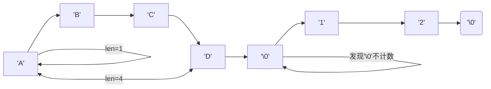
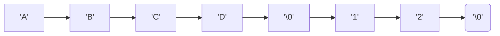
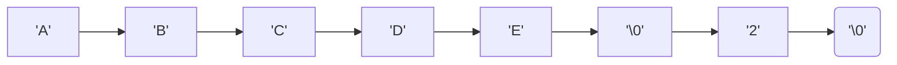
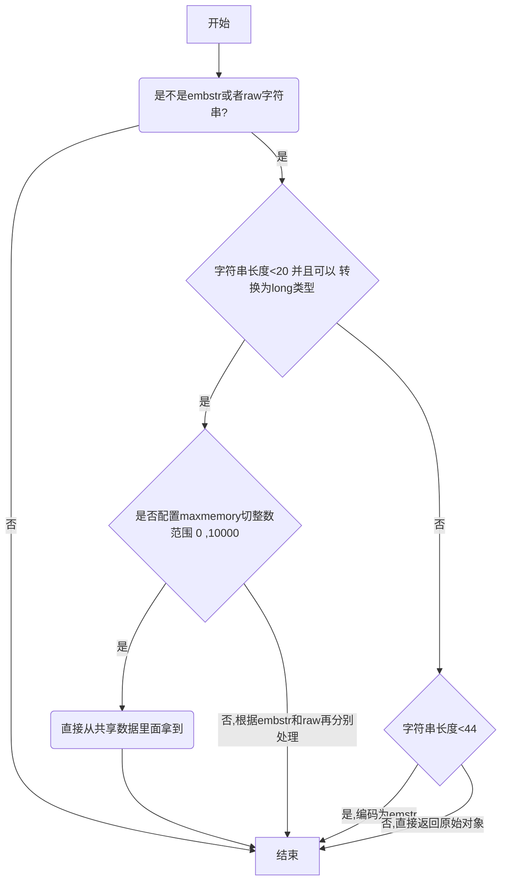

String的底层实现是SDS（Simple dynamic String）。

# SDS 结构

```
struct __attribute__ ((__packed__)) sdshdr8 {
    uint8_t len; /* 当前字符串数组的长度 */
    uint8_t alloc; /* 当前字符串分配的总内存大小 */
    unsigned char flags; /* 当前的字符串标记，用来标识是sdshdr8,sdshdr16等 */
    char buf[]; /* 字符串真正的值 */
};
```

# 相对于C语言的优势

## 统计长度时间复杂度 O(1)

　　工作中使用redis，经常会通过STRLEN命令得到一个字符串的长度， 在SDS结构中len属性记录了字符串的长度，所以我们获取一个字符串长度直接取len的值，复杂度是O(1)。



　　而如果用C字符串，在获取一个字符串长度时，需对整个字符串进行遍历，直至遍历到空格符结束（C中遇到空格符代表一个完整字符串），此时的复杂度是O(N)。

　　在高并发场景下频繁遍历字符串，获取字符串的长度很有可能成为redis的性能瓶颈，所以SDS性能更好一些。数据溢出

## 数据溢出

　　由于C字符串是不记录自身长度的，相邻的两个字符串存储的方式可能如下图，在创建字符串的时候就分配了合适的内存空间。



　　如果这个时候，想修改字符串 ABCD 成 ABCDE ，就会侵占相邻字符串的空间，自身数据溢出导致其他字符串的内容被修改。



　　而SDS很好的规避了这点，当我们需要修改数据时，首先会检查当前SDS空间len是否满足，不满足则自动扩容空间至修改所需的大小，然后再执行修改。

## 内存重分配策略

　　C字符串的长度是一定的，所以每次在增长或者是缩短字符串的时候，都需要做内存的重新分配，而内存重新分配又是一个
比较耗时的操作。

　　SDS通过两种内存重分配策略，在解决字符串增长和缩短时兼顾效率和性能

1. 空间预分配 优化SDS字符串增长

   当修改字符串并需要对SDS空间进行扩展式，不仅会分配修改所必要的空间，还会为SDS分配额外的未使用空间，
   下次修改先检查未使用空间是否满足，满足则不用再扩展空间。

+ 如果对 SDS 字符串修改后，len 值小于 1M，那么此时额外分配未使用空间 free 的大小与len相等。
+ 如果对 SDS 字符串修改后，len 值大于等于 1M，那么此时额外分配未使用空间 free 的大小为1M。

3. 惰性空间释放 优化SDS字符串缩短

　　惰性空间释放策略则用于优化SDS字符串缩短操作，当缩短SDS字符串后，并不会立即执行内存重分配来回收多余的空间，而是用free属性将这些空间记录下来，如果后续有增长操作，则可直接使用。

## 数据格式多样性

　　C字符串中的字符必须符合某些特定的编码格式，C字符串以\0空字符结尾标识一个字符串结束，所以字符串里边是不能包含\0的，不然就会被误认是多个。
由于这种限制，使得C字符串只能保存文本数据，像音视频、图片等二进制格式的数据是无法存储的。

　　redis 会以处理二进制的方式操作Buf数组中的数据，所以对存入其中的数据做任何的限制、过滤，只要存进来什么样，取出来还是什么样。

||C语言|SDS|
| :------------: | -----------------------------------------------------------------------------------------------------------------------------------------------| ------------------------------------------------------------------------------------------------------------------------------------------------------------------------------------------------------------------------------------------------------------------------------------------------------------------------------------------|
|字符串长度处理|需要从头开始遍历，直到遇到 '\0' 为止，时间复杂度O(N)|记录当前字符串的长度，直接读取即可，时间复杂度 O(1)|
|内存重新分配|分配内存空间超过后，<br />会导致数组下标越级或者内存分配溢出|空间预分配 <br>SDS 修改后，len 长度小于 1M，那么将会额外分配与 len 相同长度的未使用空间。如果修改后长度大于 1M，那么将分配1M的使用空间。<br>惰性空间释放有<br>空间分配对应的就有空间释放。SDS 缩短时并不会回收多余的内存空间，而是使用 free 字段将多出来的空间记录下来。如果后续有变更操作，直接使用 free 中记录的空间，减少了内存的分配。|
|二进制安全|二进制数据并不是规则的字符串格式，可能会包含一些特殊的字符，比如 '\0' 等。<br />前面提到过，C中字符串遇到 '\0' 会结束，那 '\0' 之后的数据就读取不上了|根据 len 长度来判断字符串结束的，二进制安全的问题就解决了|

# 三大编码

　　Redis 内部会根据用户给的不同键值而使用不同的编码格式!

+ int: 保存long型的64位有符号整数,范围 [ -2^63 , 2^63-1 ]
+ embstr: 保存长度小于44字节的字符串
+ raw: 保存长度大于44字节的字符串

　　以下是处理流程


