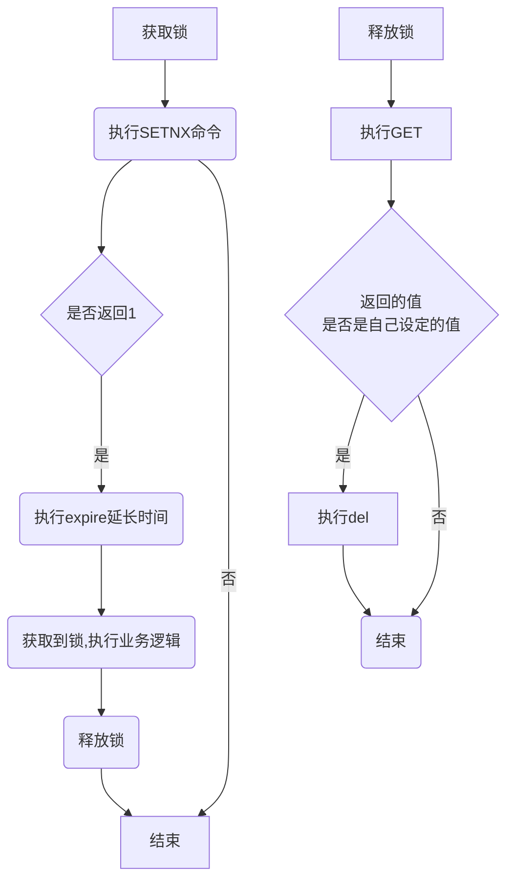

# Redis的分布式锁

# 利用redis实现分布式锁

## 三个重要因素

+ 加锁:  加锁实际上就是在redis中，给Key键设置一个值，为避免死锁，并给定一个过期时间
+ 解锁: 将Key键删除。但也不能乱删，不能说客户端1的请求将客户端2的锁给删除掉，只能自己删除自己的锁
+ 超时: 不能长期占用

## 涉及命令

1. SETNX: 当KEY不存在的时候设置KEY的值为value，返回1，当KEY存在的时候，不做任何动作返回0。

```shell
redis> setnx key value
	1
redis> setnx key value
	0
```

2. EXPIRE: 为KEY设计一个超时时间，到期自动释放，避免死锁。
3. DELETE: 删除KEY，用于业务处理完手动释放锁。

# 实现思想

1. 随机生成一个UUID，标记是当前线程，调用SETNX方法设置值，并且调用expire方法为锁加一个超期时间，到期自动释放锁。
2. 获取锁的时候，加一个超期时间，超过时间则放弃去竞争锁。
3. 释放锁的时候，判断UUID是不是  该锁，如果是则执行DELETE进行释放。



上面这么实现有什么问题么?

## 业务执行的时间大于redis锁过期的时间

一个锁设置了1分钟超时释放，如果拿到这个锁的线程在一分钟内没有执行完毕，那么这个锁就会被其他线程拿到，可能会导致严重的线上问题。

## redis部署模式的影响

在单机模式下，redis是CP模式，在对并发量不大的情况下，是可以用这种代码去实现的，单机也能够扛得住。

如果在集群模式下，redis异步复制造成的锁丢失，如果主节点没来的及把刚刚set进来这条数据给从节点，就挂了，就导致锁没有锁上，释放也是同样的逻辑

因此针对上述的情况，业界有统一的解决方案: Redlock 红锁。

## 原子性问题

SETNX + EXPIRE不是原子性的，不满足事务性 , 如果expire未执行成功，锁只能主动释放，锁存在永远得不到释放的情况, 可以使用下面的命令进行设置。

```shell
SET key value NX EX 1000
```

或者可以用lua进行设置

```lua
local key     = KEYS[1]
local content = ARGV[1]
local ttl     = tonumber(ARGV[2])
local lockSet = redis.call('setnx', key, content)
if lockSet == 1 then
  redis.call('PEXPIRE', key, ttl)
else
  -- 如果value相同，则认为是同一个线程的请求，则认为重入锁
  local value = redis.call('get', key)
  if(value == content) then
    lockSet = 1;
    redis.call('PEXPIRE', key, ttl)
  end
end
return lockSet
```

同样的，get+delete也不是原子性的

```lua
local key     = KEYS[1]
local content = ARGV[1]
local value = redis.call('get', key)
if value == content then
  return redis.call('del', key)
else
    return 0
end
```

使用java代码优化上述的问题:

```java
@RestController
public class GoodController {
    public static final String REDIS_LOCK_KEY = "redisLockPay";
    @Autowired
    private StringRedisTemplate stringRedisTemplate;
    @Value("${server.port}")
    private String serverPort;

    @GetMapping("/buy_goods")
    public String buy_Goods() {
        String value = UUID.randomUUID().toString() + Thread.currentThread().getName();
        try {
            Boolean flag = stringRedisTemplate.opsForValue().setIfAbsent(REDIS_LOCK_KEY, value, 30L, TimeUnit.SECONDS);
            if (!flag) {
                return " 抢夺锁失败，请下次尝试 ";
            }
            String result = stringRedisTemplate.opsForValue().get("goods:001");
            int goodsNumber = result == null ? 0 : Integer.parseInt(result);
            if (goodsNumber > 0) {
                int realNumber = goodsNumber - 1;
                stringRedisTemplate.opsForValue().set("goods:001", realNumber + "");
                System.out.println(" 你已经成功秒杀商品，此时还剩余： " + realNumber + " 件 " + " \t  服务器端口： " + serverPort);
                return " 你已经成功秒杀商品，此时还剩余： " + realNumber + " 件 " + " \t  服务器端口： " + serverPort;
            } else {
                System.out.println(" 商品已经售罄 / 活动结束 / 调用超时，欢迎下次光临 " + " \t  服务器端口： " + serverPort);
            }
            return " 商品已经售罄 / 活动结束 / 调用超时，欢迎下次光临 " + " \t  服务器端口： " + serverPort;
        } finally {
            Jedis jedis = RedisUtils.getJedis();
            String script = "if redis.call('get', KEYS[1]) == ARGV[1] " + "then " + "return redis.call('del', KEYS[1]) " + "else " + "   return 0 " + "end";
            try {
                Object result = jedis.eval(script, Collections.singletonList(REDIS_LOCK_KEY), Collections.singletonList(value));
                if ("1".equals(result.toString())) {
                    System.out.println("------del REDIS_LOCK_KEY success");
                } else {
                    System.out.println("------del REDIS_LOCK_KEY error");
                }
            } finally {
                if (null != jedis) {
                    jedis.close();
                }
            }
        }
    }
}   
```
