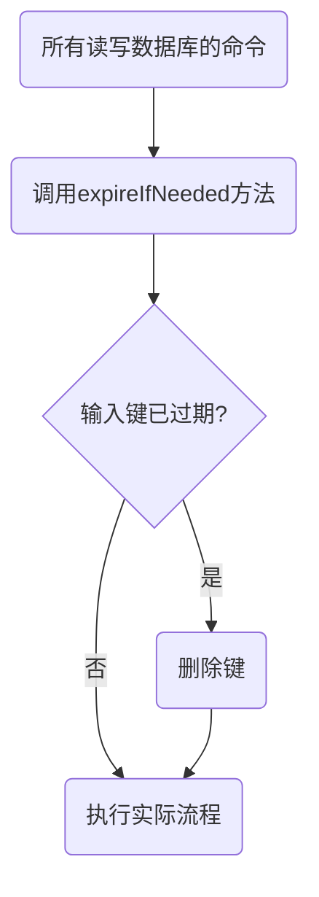

# Redis数据删除策略

Redis可以对Key设置过期时间，如果Key到过期时间，Redis是如何删除的？

Redis会将过期时间的键和过期时间存放到一个字典当中。当我们查询一个键时，redis首先检查是否在过期字典当中，如果存在，则获取其过期时间，然后将过期时间和当前时间进行对比，如果比当前时间大则认定过期，否则则认定没有过期。

Redis采用惰性删除+定期删除

|删除模式|优点|缺点|
| :------: | :-----------------------------------------------------------------------------------------------------------: | :---------------------------------------------------------------------------------------------------------------------------------------------------------------------------------------------------------------------------------------------------------------------------: |
|惰性删除|对 CPU友好，<br />我们只会在使用该键时才会进行过期检查，对于很多用不到的key不用浪费时间进行过期检查。|如果一个键已经过期，但是一直没有使用，<br />该键就会一直存在内存中，内存永远不会释放。<br />如有较多这样的过期键，容易造成内存泄漏。|
|定期删除|可以通过限制删除操作执行的时长和频率来减少删除操作对 CPU 的影响。<br />另外定期删除，也能有效释放过期键占用的内存。|难以确定删除操作执行的时长和频率。<br />如果执行的太频繁对CPU不友好。<br />如果执行频率过低，那又和惰性删除一样了，<br />过期键占用的内存不会及时得到释放。<br />另外最重要的是，在获取某个键时，如果某个键的过期时间已经到了，但是还没执行定期删除，那么就会返回这个键的值，这是业务不能忍受的错误。|

# 惰性删除



```c
int expireIfNeeded(redisDb *db, robj *key) {
    // 键未过期返回0
    if (!keyIsExpired(db,key)) return 0;
    // 如果运行在从节点上，直接返回1，因为从节点不执行删除操作
    if (server.masterhost != NULL) return 1;
    // 运行到这里，表示键带有过期时间且运行在主节点上
    // 删除过期键个数
    server.stat_expiredkeys++;
    // 向从节点和AOF文件传播过期信息
    propagateExpire(db,key,server.lazyfree_lazy_expire);
    // 发送事件通知
    notifyKeyspaceEvent(NOTIFY_EXPIRED,
        "expired",key,db->id);
    // 根据配置（默认是同步删除）判断是否采用惰性删除（这里的惰性删除是指采用后台线程处理删除操做，这样会减少卡顿）
    int retval = server.lazyfree_lazy_expire ? dbAsyncDelete(db,key) :
                                               dbSyncDelete(db,key);
    if (retval) signalModifiedKey(NULL,db,key);
    return retval;
}
```

# 定期删除

定期策略是每隔一段时间执行一次删除过期键的操作，并通过限制删除操作执行的时长和频率来减少删除操作对CPU 时间的影响，同时也减少了内存浪费

Redis 默认会每秒进行 10 次（redis.conf 中通过 hz 配置）过期扫描，扫描并不是遍历过期字典中的所有键，而是采用了如下方法

1. 从过期字典中随机取出 20 个键(ACTIVE_EXPIRE_CYCLE_KEYS_PER_LOOP)
2. 删除这 20 个键中过期的键
3. 如果过期键的比例超过 25% ，重复步骤 1 和 2

为了保证扫描不会出现循环过度，导致线程卡死现象，还增加了扫描时间的上限，默认是 25 毫秒(ACTIVE_EXPIRE_CYCLE_SLOW_TIME_PERC)（即默认在慢模式下，如果是快模式，扫描上限是 1 毫秒）

从定期回收策略的慢速检查中，我们可以看到，redis 处理到期数据，通过采样，判断到期数据的密集度。到期数据越密集，处理时间越多。我们使用中，不应该把大量数据设置在同一个时间段到期。

底层源码实现:

```c
void activeExpireCycle(int type) {
    /* Adjust the running parameters according to the configured expire
     * effort. The default effort is 1, and the maximum configurable effort
     * is 10. */
    unsigned long
    // 努力力度，默认 1，也就是遍历过期字典的力度，力度越大，遍历数量越多，但是性能损耗更多。
    effort = server.active_expire_effort-1, /* Rescale from 0 to 9. */
    // 每次循环遍历键值个数。力度越大，遍历个数越多。
    config_keys_per_loop = ACTIVE_EXPIRE_CYCLE_KEYS_PER_LOOP +
                           ACTIVE_EXPIRE_CYCLE_KEYS_PER_LOOP/4*effort,
    // 快速遍历时间范围，力度越大，给予遍历时间越多。
    config_cycle_fast_duration = ACTIVE_EXPIRE_CYCLE_FAST_DURATION +
                                 ACTIVE_EXPIRE_CYCLE_FAST_DURATION/4*effort,
    // 慢速遍历检查时间片
    config_cycle_slow_time_perc = ACTIVE_EXPIRE_CYCLE_SLOW_TIME_PERC +
                                  2*effort,
    // 已经到期数据 / 检查数据 比例。达到可以接受的比例。
    config_cycle_acceptable_stale = ACTIVE_EXPIRE_CYCLE_ACCEPTABLE_STALE-
                                    effort;

    /* This function has some global state in order to continue the work
     * incrementally across calls. */
    static unsigned int current_db = 0; /* Last DB tested. */
    // 检查是否已经超时。
    static int timelimit_exit = 0;      /* Time limit hit in previous call? */
    // 上一次快速检查数据起始时间。
    static long long last_fast_cycle = 0; /* When last fast cycle ran. */

    // iteration 迭代检查个数，每 16 次循环遍历，确认一下是否检查超时。
    int j, iteration = 0;
    // 每次周期检查的数据库个数。redis 默认有 16 个库。
    int dbs_per_call = CRON_DBS_PER_CALL;
    long long start = ustime(), timelimit, elapsed;

    /* When clients are paused the dataset should be static not just from the
     * POV of clients not being able to write, but also from the POV of
     * expires and evictions of keys not being performed. */
    /* 如果链接已经停止了，那么要保留现场，不允许修改数据，也不允许到期淘汰数据。
     * 使用命令 ‘pause’ 暂停 redis 工作或者主服务正在进行从服务的故障转移。*/
    if (clientsArePaused()) return;

    if (type == ACTIVE_EXPIRE_CYCLE_FAST) {
        /* 检查还没超时，但是到期数据密集度已经达到了可以接受的范围，不要快速检查了，
           毕竟它是快速的，留给其它方式的检查。*/
        if (!timelimit_exit &&
            server.stat_expired_stale_perc < config_cycle_acceptable_stale)
            return;
        /* 限制快速检查频次，在两个 config_cycle_fast_duration 内，只能执行一次快速检查。 */
        if (start < last_fast_cycle + (long long)config_cycle_fast_duration*2)
            return;

        last_fast_cycle = start;
    }

    /* We usually should test CRON_DBS_PER_CALL per iteration, with
     * two exceptions:
     *
     * 1) Don't test more DBs than we have.
     * 2) If last time we hit the time limit, we want to scan all DBs
     * in this iteration, as there is work to do in some DB and we don't want
     * expired keys to use memory for too much time. */
    if (dbs_per_call > server.dbnum || timelimit_exit)
        dbs_per_call = server.dbnum;

    /* 检查过期数据，但是不能太损耗资源，得有个限制。server.hz 默认为 10
      hz 是执行后台任务的频率，越大表明执行的次数越频繁，一般用默认值 10 */
    timelimit = config_cycle_slow_time_perc*1000000/server.hz/100;
    timelimit_exit = 0;
    if (timelimit <= 0) timelimit = 1;
    // 如果是快速模式，更改检查周期时间。
    if (type == ACTIVE_EXPIRE_CYCLE_FAST)
        timelimit = config_cycle_fast_duration; /* in microseconds. */


    /* 过期数据一般是异步方式，检查到过期数据，都是从字典中移除键值信息，
     * 避免再次使用，但是数据回收放在后台回收，不是实时的，有数据有可能还存在数据库里。*/
    // 检查数据个数。
    long total_sampled = 0;
    // 检查数据，数据已经过期的个数。
    long total_expired = 0;

    for (j = 0; j < dbs_per_call && timelimit_exit == 0; j++) {
        /* Expired and checked in a single loop. */
        unsigned long expired, sampled;

        redisDb *db = server.db+(current_db % server.dbnum);

        /* Increment the DB now so we are sure if we run out of time
         * in the current DB we'll restart from the next. This allows to
         * distribute the time evenly across DBs. */
        current_db++;

        /* Continue to expire if at the end of the cycle there are still
         * a big percentage of keys to expire, compared to the number of keys
         * we scanned. The percentage, stored in config_cycle_acceptable_stale
         * is not fixed, but depends on the Redis configured "expire effort". */
        // 遍历数据库检查过期数据，直到超出检查周期时间，或者过期数据比例已经很少了。
        do {
            // num 数据量，slots 哈希表大小（字典数据如果正在迁移，双表大小）
            unsigned long num, slots;
            long long now, ttl_sum;
            int ttl_samples;
            iteration++;

            /* If there is nothing to expire try next DB ASAP. */
            if ((num = dictSize(db->expires)) == 0) {
                db->avg_ttl = 0;
                break;
            }
            slots = dictSlots(db->expires);
            now = mstime();

            /* 过期存储数据结构是字典，数据经过处理后，字典存储的数据可能已经很少，
            * 但是字典还是大字典，这样遍历数据有效命中率会很低，处理起来会浪费资源，
            * 后面的访问会很快触发字典的缩容，缩容后再进行处理效率更高。*/
            if (num && slots > DICT_HT_INITIAL_SIZE &&
                (num*100/slots < 1)) break;

            // 过期的数据个数。
            expired = 0;
            // 检查的数据个数。
            sampled = 0;
            // 没有过期的数据时间差之和。
            ttl_sum = 0;
            // 没有过期的数据个数。
            ttl_samples = 0;

            // 每次检查的数据限制。
            if (num > config_keys_per_loop)
                num = config_keys_per_loop;

            /* 哈希表本质上是一个数组，可能有键值碰撞的数据，用链表将碰撞数据串联起来，
            * 放在一个数组下标下，也就是放在哈希表的一个桶里。max_buckets 是最大能检查的桶个数。
            * 跳过空桶，不处理。*/
            long max_buckets = num*20;
            // 当前已经检查哈希表桶的个数。
            long checked_buckets = 0;
            // 一个桶上有可能有多个数据。所以检查从两方面限制：一个是数据量，一个是桶的数量。
            while (sampled < num && checked_buckets < max_buckets) {
                for (int table = 0; table < 2; table++) {
                    // 如果 dict 没有正在进行扩容，不需要检查它的第二张表了。
                    if (table == 1 && !dictIsRehashing(db->expires)) break;

                    unsigned long idx = db->expires_cursor;
                    idx &= db->expires->ht[table].sizemask;
                    dictEntry *de = db->expires->ht[table].table[idx];
                    long long ttl;

                    // 检查数据是否已经超时。
                    checked_buckets++;
                    while(de) {
                        /* Get the next entry now since this entry may get
                         * deleted. */
                        dictEntry *e = de;
                        de = de->next;

                        ttl = dictGetSignedIntegerVal(e)-now;
                        // 如果数据过期了，进行回收处理。
                        if (activeExpireCycleTryExpire(db,e,now)) expired++;
                        if (ttl > 0) {
                            /* We want the average TTL of keys yet
                             * not expired. */
                            ttl_sum += ttl;
                            ttl_samples++;
                        }
                        sampled++;
                    }
                }
                db->expires_cursor++;
            }
            total_expired += expired;
            total_sampled += sampled;

            /* Update the average TTL stats for this database. */
            if (ttl_samples) {
                long long avg_ttl = ttl_sum/ttl_samples;

                /* Do a simple running average with a few samples.
                 * We just use the current estimate with a weight of 2%
                 * and the previous estimate with a weight of 98%. */
                if (db->avg_ttl == 0) db->avg_ttl = avg_ttl;
                // 对没过期的数据，平均过期时间进行采样，上一次统计的平均时间占 98 %，本次占 2%。
                db->avg_ttl = (db->avg_ttl/50)*49 + (avg_ttl/50);
            }

            /* We can't block forever here even if there are many keys to
             * expire. So after a given amount of milliseconds return to the
             * caller waiting for the other active expire cycle. */
            /* 避免检查周期太长，当前数据库每 16 次循环迭代检查，检查是否超时，超时退出。*/
            if ((iteration & 0xf) == 0) { /* check once every 16 iterations. */
                elapsed = ustime()-start;
                if (elapsed > timelimit) {
                    timelimit_exit = 1;
                    server.stat_expired_time_cap_reached_count++;
                    break;
                }
            }
            /* 当前数据库，如果没有检查到数据，或者过期数据已经达到可接受比例
             * 就退出该数据库检查，进入到下一个数据库检查。*/
        } while (sampled == 0 ||
                 (expired*100/sampled) > config_cycle_acceptable_stale);
    }

    elapsed = ustime()-start;
    server.stat_expire_cycle_time_used += elapsed;
    latencyAddSampleIfNeeded("expire-cycle",elapsed/1000);

    // 添加统计信息
    double current_perc;
    if (total_sampled) {
        current_perc = (double)total_expired/total_sampled;
    } else
        current_perc = 0;
    // 通过累加每次检查的过期概率影响，保存过期数据占数据比例。
    server.stat_expired_stale_perc = (current_perc*0.05)+
                                     (server.stat_expired_stale_perc*0.95);
}
```

# AOF、RDB 和复制功能对过期键的处理

## RDB

**生成 RDB 文件**

在执行 save 命令或 bgsave 命令创建一个新的 RDB文件时，程序会对数据库中的键进行检查，已过期的键就不会被保存到新创建的 RDB文件中

**载入 RDB 文件**

**主服务器**：载入 RDB 文件时，会对键进行检查，过期的键会被忽略

**从服务器**：载入 RDB文件时，所有键都会载入。但是会在主从同步的时候，清空从服务器的数据库，所以过期的键载入也不会造成啥影响

## AOF

**AOF 文件写入**

当过期键被惰性删除或定期删除后，程序会向 AOF 文件追加一条 del 命令，来显示的记录该键已经被删除

**AOF 重写**

重启过程会对键进行检查，如果过期就不会被保存到重写后的 AOF 文件中

## 复制

**从服务器的过期键删除动作由主服务器控制**

主服务器在删除一个过期键后，会显示地向所有从服务器发送一个 del 命令，告知从服务器删除这个过期键

从服务器收到在执行客户端发送的读命令时，即使碰到过期键也不会将其删除，只有在收到主服务器的 del 命令后，才会删除，这样就能保证主从服务器的数据一致性

# 疑问点？

1. 如果主从服务器链接断开怎么办？
2. 如果发生网络抖动，主服务器发送的 del 命令没有传递到从服务器怎么办？

其实上面两个问题 Redis 开发者已经考虑到了，只是主从复制涉及到的知识点还挺多，下面我就简单的说下解决的思路，后面会再分享一篇主从复制的文件

## 如果主从服务器链接断开怎么办？

Redis 采用 PSYNC 命令来执行复制时的同步操作，当从服务器在断开后重新连接主服务器时，主服务器会把从服务器断线期间执行的写命令发送给从服务器，然后从服务器接收并执行这些写命令，这样主从服务器就会达到一致性。

那主服务器如何判断从服务器断开链接的过程需要哪些命令？

主服务器会维护一个固定长度的先进先出的队列，即复制积压缓冲区，缓冲区中保存着主服务器的写命令和命令对应的偏移量，在主服务器给从服务器传播命令时，同时也会往复制积压缓冲区中写命令。

从服务器在向主服务器发送 PSYNC 命令时，同时会带上它的最新写命令的偏移量，这样主服务器通过对比偏移量，就可以知道从服务器从哪里断开的了

## 如果发生网络抖动，主服务器发送的 del 命令没有传递到从服务器怎么办？

其实主从服务器之间会有心跳检测机制，主从服务器通过发送和接收 REPLCONF ACK 命令来检查两者之间的网络连接是否正常。

当从服务器向主服务器发送 REPLCONF ACK 命令时，主服务器会对比自己的偏移量和从服务器发过来的偏移量。

如果从服务器的偏移量小于自己的偏移量，主服务器会从复制积压缓冲区中找到从服务器缺少的数据，并将数据发送给从服务器，这样就达到了数据一致性
