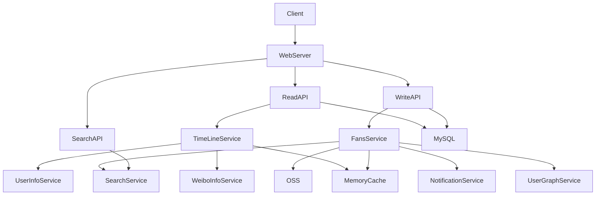

# 微博架构设计

微博日活跃用户1.6亿+，每日访问量达百亿级，面对庞大用户群的海量访问，需要有良好的架构设计来支撑微博这庞大的访问量。

# 概述用例和约束

## 用例

* **用户**发布了一条微博

  **服务**将微博推送给关注者，并且进行手机推送
* **用户**浏览自己的微博列表
* **用户**浏览主页的微博列表（聚合关注的人的微博）
* **用户**可以通过关键词搜索
* **服务**应该具有高可用性

## 限制条件与假设

普遍情况

* 网络流量不是均匀分布的
* 发布微博的速度需要足够快速

  * 除非有上百万的关注者，否则将微博推送给粉丝的速度要足够快
* 1 亿个活跃用户
* 每天新发布 5 亿条微博，每月新发布 150 亿条微博

  * 平均每条微博需要推送给 5 个人
  * 每天需要进行 50 亿次推送
  * 每月需要进行 1500 亿次推送
* 每月需要处理 2500 亿次读取请求
* 每月需要处理 100 亿次搜索

浏览功能

* 浏览的速度需要足够快
* 读取的负载远大于写入的负载

搜索功能

* 搜索的速度需要足够快

* 搜索是高负载的读取功能

计算用量

* 每条微博的大小：

  * `weibo_id` - 8 字节
  * `user_id` - 32 字节
  * `text` - 140 字节
  * `media` - 平均 10 KB
  * 总计： 大约 10 KB
* 每月产生新微博的内容为 150 TB

  * 每条微博 10 KB * 每天 5 亿条微博* 每月 30 天
  * 3 年产生的内容为 5.4 PB
* 每秒需要处理 10 万次读取请求

  * 每个月需要处理 2500 亿次请求 * (每秒 400 次请求 / 每月 10 亿次请求)
* 每秒发布 6000 条微博

  * 每月发布 150 亿条微博 * (每秒 400 次请求 / 每月 10 次请求)
* 每秒推送 6 万条微博

  * 每月推送 1500 亿条微博 * (每秒 400 次请求 / 每月 10 亿次请求)
* 每秒 4000 次搜索请求

# 概要设计

# 设计核心组件

## 用例: 用户发表了一篇微博

我们可以简单的先将数据存储到MySQL中。

查看当前用户的关注的人发的微博以及推送数据是非常麻烦的事情。

根据预估容量，每秒大概会产生6万条数据，这个操作一般的关系型数据库可能会支撑不住，因此可以通过NoSQL数据库或者内存数据库来对数据进行存储。

而且对于微博架构这种，大V发送了微博远比普通的用户发送的微博带来的影响大，会造成数据的倾斜。

一般情况下处理这种情况下会采用推拉结合的模式来进行处理:

* 推模式

  如果用户被关注的人少，发送了微博，就直接将微博发送到各个人的收件箱中
* 拉模式

  如果用户被关注的人多，发送了微博就存储在自己的发件箱里，关注的人拉取自己的关注的人时在对关注的人的发件箱和自己的收件箱进行一个聚合

处了数据模型，还需要对静态文件进行一个处理，可以借助于三方的对象存储来存储照片和视频之类的媒体文件。

* **客户端**向应用反向代理的**Web 服务器**发送一条微博
* **Web 服务器**将请求转发给**写 API**服务器
* **写 API**服务器将微博使用 **SQL 数据库**存储于用户收件箱
* **写 API**调用 **消息输出服务** ，进行以下操作：

  * 查询**用户服务**找到存储于**内存缓存**中的此用户的粉丝
  * 将微博存储于**内存缓存**中的**此用户的粉丝的主页TimeLine**中

    * O(n) 复杂度操作： 1000 名粉丝 = 1000 次查找与插入
  * 将微博数据存储在**搜索索引服务**中，以加快搜索
  * 将媒体存储于**对象存储**中
  * 使用**通知服务**向粉丝发送推送：

    * 使用**队列**异步推送通知

## 用例：用户浏览聚合主页时间轴

* **客户端**向 **Web 服务器**发起一次读取主页的请求
* **Web 服务器**将请求转发给**读取 API**服务器
* **读取 API**服务器调用**TimeLine服务**进行以下操作：

  * 从**内存缓存**读取时间轴数据，其中包括微博id 与用户 id - O(1)
  * 通过 [multiget](http://redis.io/commands/mget) 向**微博**​**信息服务**进行查询，以获取相关 id 微博的额外信息 - O(n)
  * 通过 muiltiget 向**用户信息服务**进行查询，以获取相关 id 用户的额外信息 - O(n)

## 用例：用户浏览用户时间轴

* **客户端**向**Web 服务器**发起获得用户时间线的请求
* **Web 服务器**将请求转发给**读取 API**服务器
* **读取 API**从 **SQL 数据库**中取出用户的TimeLine

## 用例：用户搜索关键词

* **客户端**将搜索请求发给**Web 服务器**
* **Web 服务器**将请求转发给**搜索 API**服务器
* **搜索 API**调用**搜索服务**进行以下操作：

  * 对输入进行转换与分词，弄明白需要搜索什么东西

    * 移除标点等额外内容
    * 将文本打散为词组
    * 修正拼写错误
    * 规范字母大小写
    * 将查询转换为布尔操作
  * 查询 **搜索集群** （例如Lucene、ES）检索结果：

    * 对集群内的所有服务器进行查询，将有结果的查询进行聚合（Scatter gathers）
    * 合并取到的条目，进行评分与排序，最终返回结果

# 架构扩展

**消息发送服务**有可能成为性能瓶颈。那些有着百万数量关注着的用户可能发一条微博就需要好几分钟才能完成消息的发送进程。这有可能使 @回复 这种微博时出现竞争条件，因此需要根据服务时间进行重排序来降低影响。

我们还可以避免从高关注量的用户输出。相反，我们可以通过搜索来找到高关注量用户的微博，并将搜索结果与用户的主页时间轴合并，再根据时间对其进行排序。

此外，还可以通过以下内容进行优化：

* 仅为每个主页时间轴在**内存缓存**中存储数百条数据
* 仅在**内存缓存**中存储活动用户的主页时间轴

  * 如果某个用户在过去 30 天都没有产生活动，那我们可以使用 **SQL 数据库**重新构建他的时间轴

    * 使用**用户服务**来查询并确定用户关注的人
    * 从 **SQL 数据库**中取出推特，并将它们存入**内存缓存**
* 仅在**微博**​**信息服务**中存储一个月的推特
* 仅在**用户信息服务**中存储活动用户的信息
* **搜索集群**需要将推特保留在内存中，以降低延迟

我们还可以考虑优化 **SQL 数据库** 来解决一些瓶颈问题。

**内存缓存**能减小一些数据库的负载，靠 **SQL Read 副本**已经足够处理缓存未命中情况。我们还可以考虑使用一些额外的 SQL 性能拓展技术。

高容量的写入将淹没单个的 **SQL 写主从**模式，因此需要更多的拓展技术。

除此之外，还需要对热点事件造成的流量突增进行处理。可以采用容器化进行部署，流量或者负载达到一定程度就扩容。
