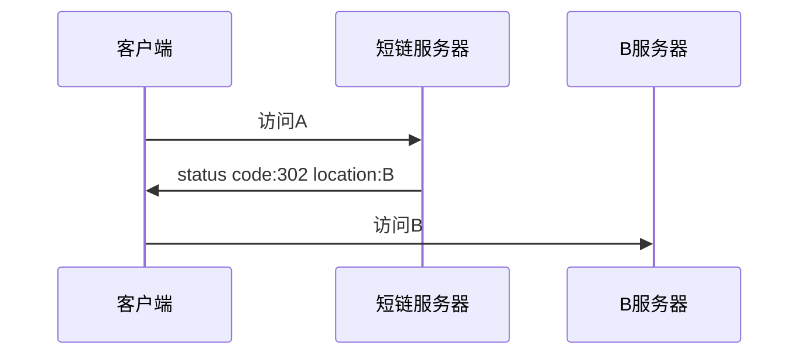
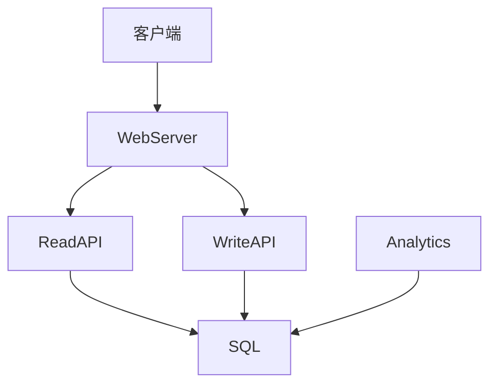
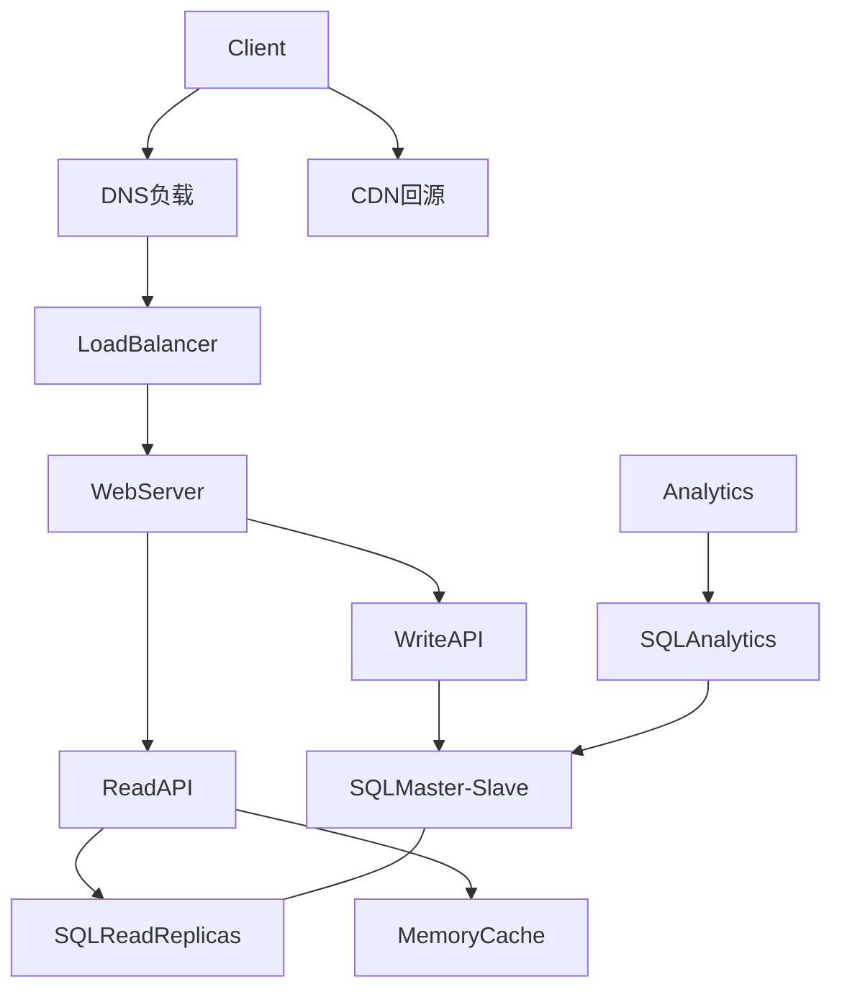

a短链系统设计看起来简单，但是每个点都能展开很多知识点。短链是通过访问服务器上的链接，通过Http返回的302Code，对链接进行重定向，然后访问到对应的地址上。

　　



　　Http协议中重定向有两种code: 301 、302

* 301: 代表永久**重定向**。
* 302: 代表**临时重定向**。

　　他们的区别就在于浏览器会对301做缓存的效果，如果返回的code是301，则浏览器缓存A到B的映射，在下次发起请求的时候不会再去请求A的服务器。

# 概述用例和约束

## 用例

* **用户** 输入一段文本，然后得到一个随机生成的链接

  * 过期设置

    * 默认的设置是不会过期的
    * 可以选择设置一个过期的时间
* **用户** 输入一个 paste 的 url 后，可以看到它存储的内容
* **用户** 是匿名的
* **Service** 跟踪页面分析

  * 一个月的访问统计
* **Service** 删除过期的 pastes
* **Service** 需要高可用

## 约束和假设

* 访问流量不是均匀分布的
* 打开一个短链接应该是很快的
* pastes 只能是文本
* 页面访问分析数据可以不用实时
* 一千万的用户量
* 每个月一千万的 paste 写入量
* 每个月一亿的 paste 读取量
* 读写比例在 10:1

## 预估容量

* 每个 paste 的大小

  * 每一个 paste 1 KB
  * `shortlink` - 7 bytes
  * `expiration_length_in_minutes` - 4 bytes
  * `created_at` - 5 bytes
  * 总共 = ~1.27 KB
* 每个月新的 paste 内容在 12.7GB

  * (1.27 * 10000000)KB / 月的 paste
  * 三年内将近 450GB 的新 paste 内容
  * 三年内 3.6 亿短链接
  * 假设大部分都是新的 paste，而不是需要更新已存在的 paste
* 平均 4paste/s 的写入速度
* 平均 40paste/s 的读取速度

# 创建一个高层次设计

　　用webServer作为请求的入口，然后调用API去访问SQL。最后采用Analytics对请求数据进行分析。



# 设计核心组件

## 用例: **用户**输入一段文本，然后得到一个随机生成的链接

　　用关系型数据库直接将生成的URL映射成用户的URL。

* **客户端** 发送一个创建 paste 的请求到作为一个[反向代理](https://github.com/donnemartin/system-design-primer/blob/master/README-zh-Hans.md#%E5%8F%8D%E5%90%91%E4%BB%A3%E7%90%86web-%E6%9C%8D%E5%8A%A1%E5%99%A8)启动的  **Web 服务器** 。
* **Web 服务器** 转发请求给 **写接口** 服务器
* **写接口** 服务器执行如下操作：

  * 生成一个唯一的 url

    * 检查这个 url 在 **SQL 数据库** 里面是否是唯一的
    * 如果这个 url 不是唯一的，生成另外一个 url
    * 如果我们支持自定义 url，我们可以使用用户提供的 url（也需要检查是否重复）
  * 把生成的 url 和用户的url 存储到 **SQL 数据库** 的 `pastes` 表里面
  * 返回生成的 url

　　`pastes`结构如下:

```sql
shortlink char(7) NOT NULL
expiration_length_in_minutes int NOT NULL
created_at datetime NOT NULL
paste varchar(2048) NOT NULL
PRIMARY KEY(shortlink)
```

　　在`shortlink`上创建一个数据库索引，用来提高查询的速度。

## 用例：用户输入一个 paste 的 url 后可以看到它存储的内容

* **客户端** 发送一个获取 paste 请求到 **Web Server**
* **Web Server** 转发请求给 **读取接口** 服务器
* **读取接口** 服务器执行如下操作：

  * 在 **SQL 数据库** 检查这个生成的 url

    * 如果这个 url 在 **SQL 数据库** 里面，则从返回这个 `paste` 的内容
    * 否则，返回一个错误页面给用户

## 用例： 服务跟踪分析页面

　　因为实时分析不是必须的，所以我们可以简单的 **MapReduce** **Web Server** 的日志，用来生成点击次数。

## 用例： 服务删除过期的 pastes

　　为了删除过期的 pastes，我们可以直接搜索 **SQL 数据库** 中所有的过期时间比当前时间更早的记录， 所有过期的记录将从这张表里面删除（或者将其标记为过期）。

# 扩展设计



* 对于请求量比较大的，应该将数据留在上游，这部分可以采用CDN来代理源站，将数据放在边缘
* 使用LoadBalancer来代理我们具体的服务器，以便于可以对webServer进行水平扩展
* 处理每秒40的读请求，其内容应该交由给内存级别的缓存来处理。比如Redis这种
* 对于单个关系型数据库，主从切分之后每秒4次的写入问题不大。

  如果写入出现了瓶颈，需要额外采用别的方式。包括但不限于：

  1. 水平、垂直分片
  2. 非规范化
  3. SQL调优

# 总结

　　对于短链系统，整体的系统的设计大概如此，从架构方面应该是满足要求了。

　　其次，还有一些细节在我看来就是属于业务上的东西了，需要自行衡量,比如: 短链生成方法有好几种方式，Hash、Md5、UUID、redis、Snowflake、Mysql 自增主键。其选型并没有什么优劣之分，只有合适与否。

　　整个系统的诞生是一个不断优化的过程，我们需要先解决有的问题，再持续进行优化。

* 继续对系统进行基准测试和监控，以在瓶颈出现时解决它们
* 扩展是一个迭代的过程

　　
