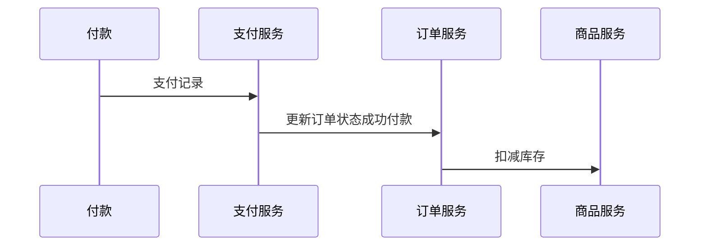

> 秒杀的三个特点: 
>
> 整点开始
>
> 数量有限
>
> 售完截止
>

# Scenario场景

　　QPS预测:

1. 平日每秒1K人访问该页面
2. 秒杀每秒数十万人访问该页面
3. QPS增加100倍

　　商品购买和下单流程: 

　　

　　秒杀情况下最大的几个难点：

1. 瞬时大流量高并发

    服务器、数据库承载的QPS有限，如数据库一般是1000QPS。要根据业务预估并发量，临时扩容

    平常qps就大几百，秒杀情况下，并发量是数十倍
2. 有限库存，不能超卖

    需要精准控制库存量，保证数据一致性（面试热点）
3. 恶意请求

    脚本模拟购买，模拟几十万请求去抢购
4. 固定时间开启

    时间到了才能买，以为服务器时间为准，NTP同步？
5. 严格限购

    用户只能买1个或N个

## 需求拆解

　　商家侧

* 新建秒杀活动
* 配置秒杀活动

　　用户侧

* 商品秒杀页面
* 购买
* 下单
* 付款

# Service 服务

　　采用微服务架构来对系统进行开发，单独抽取秒杀模块以为防止雪崩。

　　关于单体架构和微服务的架构可以看[这里](../../概念)

　　

# Storage存储

　　数据如何存储和访问

1. 为每个Service选择存储结构

2. 细化表结构

### 商品信息表 commodity_info

|商品ID|商品名称|商品描述|价格|
| --------| ----------| ----------| ---------|
|id|name|desc|price<br />|
|1|MBP<br />|好用|25000|

### 秒杀活动表 seckill_info

|秒杀ID|秒杀名称|商品ID|价格|数量<br />|
| --------| ----------| --------------| -------| --------|
|id|name|commodity_id|price|number|
|1|MBP秒杀|1|20000|100|

### 库存信息表 stock_info

|库存ID|商品ID|秒杀ID|库存|锁定<br />|
| --------| ----------------| ------------| -------| --------|
|id|commodity_id<br />|seckill_id|stock|lock|
|1|189|0|10000|0|
|2|189|1|100|5|

### 订单信息表 order_info

|订单ID|商品ID|活动ID|用户ID|是否付款|
| --------| --------------| ------------| ----------| ----------|
|id|commodity_id|seckill_id|user_id|is_pay|
|1|1|1|tianzeng|1|

## 数据流向

　　

　　秒杀操作:

1. 查询库存余量

    ```sql
    select stock from stock_info where commodity_id = 1 and seckill_id = 1
    ```
2. 扣减库存

    ```sql
    update stock_info set stock = stock - 1 where commodity_id = 1 and seckill_id = 1
    ```

　　‍

# Scala扩展设计

　　秒杀本身是一个非常简单的服务，不简单的是可优化的点非常的多。

## 数据一致性

　　我们上文直接采用MySQL，来应对查询，校验，扣减这一系列操作。但是这种粗暴的处理方式，在并发场景下会有超卖的问题。

　　‍

　　假如有两个线程进来，在第一步的时候都查询了库存，都认为当前线程持有库存。

　　于是在扣减库存的时候，会把库存库存减少两次，会造成数据库中的数据和预期的不一致。

　　‍

　　这种情况，我们可以开启事务进行处理, 在查询的时候使用for update 开启排他锁，以保证一个时间内，只有一个线程可以参与库存扣减

```sql
# 事务开始，会开启排它锁
start transaction;
select stock from stock_info where commodity_id = 1 and seckill_id = 1 for update;
update stock_info set stock = stock - 1 where commodity_id = 1 and seckill_id = 1 and 
commit;
```

　　或者，使用乐观锁，只能够在库存数量大于0的的情况下，才能够执行库存的扣减

```sql
select stock from stock_info where commodity_id = 1 and seckill_id = 1 for update;
update stock_info set stock = stock - 1 where commodity_id = 1 and seckill_id = 1 and stock > 0;
```

## 应对高QPS

　　我们可以直接利用MySQL自己的特性去解决超卖问题，但是单纯的使用MySQL在并发量上来之后会直接导致MySQL崩溃。

> MySQl的QPS单点1000QPS，秒杀场景下MySQL崩溃，且秒杀场景下大部分请求无效，无需下沉到MySQL。
>

　　因此需要更加高效的中间件来做这部分服务，将无效的请求拦截到上游，我们可以采用Redis，单机Redis能达到 10万QPS。

　　将库存信息放到Redis中，在Redis中做库存的校验。在活动上线之前，在Redis中提前做库存的预热，查询、校验、扣减先在Redis中处理好之后，再丢到MySQL进行处理。

　　‍

　　在活动开始之前，从数据库读取秒杀活动，然后用下面的命令将商品库存预热到redis中

```sql
# 设置秒杀ID为1，商品ID为1的库存数量，只有100个
SET seckill:1:commodity:1:stock 100
```

　　然后，在用户请求过来的时候，用Redis拦截大量无效请求，通过Redis扣减库存之后在下方到MySQL中

　　

## Redis的缺陷优化

　　并发量超高，同时数百万请求同时到达Redis的库存检测逻辑，Redis全部放行，这时候Redis基本无作用。

　　可以用Lua脚本将读取库存和库存扣减合并成一个操作来进行执行。

```lua
local key=KEYS[1];
local subNum = tonumber(ARGV[1]) ;
local surplusStock = tonumber(redis.call('get',key));
if (surplusStock<=0) then return 0
elseif (subNum > surplusStock) then  return 1
else
    redis.call('incrby', KEYS[1], -subNum)
    return 2 
end
```

　　

　　这种系统已经可以应对绝大多数的情况了

## 这样就完美了吗？

　　如果我们要秒杀的商品数据量在10W，这样下城到MySQL的量依旧非常巨大，无法承受。

　　所以在库存扣减之后，到MySQL的请求慢一点，可以通过MQ来进行削峰

　　

　　‍

## 分布式事务

　　由于采用的是微服务来进行开发，一个成功的订单需要历经各种服务。



　　所以需要分布式事务来对数据一致性，进行处理。关于分布式事务，看[这里](/topic/分布式解决方案/数据调度/分布式事务/事务分类)

## 其他的小细节

### 防止刷爆商品页面

　　CDN -> 前端资源静态化

### 服务高可用

　　尽量不要影响其他服务，尤其是非秒杀产品的正常购买。

### 防止恶意刷请求或者爬虫请求

　　使用限流机制、验证码机制、或者接入三方风控等。

　　‍

　　‍
